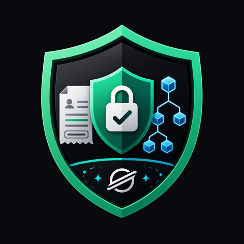

# ZK Paycheck Shield

<p align="center">
  
</p>

<p align="center">
  <b>Privacy-preserving payroll on Stellar using zero-knowledge proofs.</b>
</p>

<p align="center">
  <a href="https://github.com/jj5437/zk-paycheck-shield/blob/master/LICENSE">
    
  </a>
  
  
</p>

---

## Problem

On-chain payroll exposes every employee's identity and salary. Anyone with a block explorer can inspect who was paid, how much they received, and when it happened. That creates privacy risks for employees and competitive, compliance, and security risks for employers.

**ZK Paycheck Shield** proves you are on the payroll without revealing who you are or how much you earn.

---

## Solution

Employers commit only a **Merkle root** to Stellar. Employees submit a **zero-knowledge proof** that they are in the payroll tree and that their claim is within the allowed salary range. The public ledger sees a proof and a nullifier — not a name or salary amount.

| Before (Public Payroll) | After (ZK Paycheck Shield) |
|---|---|
| Employee name visible on-chain | Only a nullifier is revealed |
| Salary amount exposed in transaction | Proof verifies range without revealing amount |
| Full payment history public | Employer retains auditability via private off-chain data |
| Competitive & compliance risk | Cryptographic privacy with contract-enforced rules |

---

## Key Features

- **Zero-knowledge payroll membership proof** — Prove inclusion in the employer's Merkle tree without revealing identity or path.
- **Salary range proof** — Claim amount must be greater than 0 and at most 10,000 XLM, enforced by the circuit.
- **Nullifier-based anti-replay** — Prevents double claims while preserving anonymity.
- **Batch claim support** — Process multiple claims efficiently.
- **Employer dashboard** — Generate payroll roots and visualize Merkle proofs.
- **Compliance dashboard** — Track claim status with JSON/CSV audit export.
- **Privacy comparison flow** — Interactive before/after visualization of public vs. ZK-protected payroll.
- **On-chain verification** — BN254 Groth16 verifier deployed as a Soroban smart contract.

---

## Architecture

```
┌─────────────────┐     ┌──────────────────┐     ┌─────────────────┐
│  Employer UI    │────▶│  Payroll Merkle  │────▶│  Soroban        │
│  (React/Vite)   │     │  Tree + Root     │     │  Payroll        │
└─────────────────┘     └──────────────────┘     │  Contract       │
                                                  │  (Testnet)      │
┌─────────────────┐     ┌──────────────────┐     └────────┬────────┘
│  Employee UI    │────▶│  ZK Proof Gen    │              │
│  (snarkjs)      │     │  (Groth16)       │              │
└─────────────────┘     └──────────────────┘              │
                                    │                     │
                                    ▼                     ▼
                           ┌──────────────────┐   ┌─────────────────┐
                           │  Proof + Nullifier│──▶│  BN254 Verifier │
                           │                  │   │  Contract       │
                           └──────────────────┘   └─────────────────┘
```

| Component | Technology |
|---|---|
| **Circuit** | Circom 2.2 — Poseidon Merkle inclusion, Mux1, IsZero, and range proof constraints (1,015 constraints) |
| **Proof System** | Groth16 via snarkjs |
| **Blockchain** | Stellar Testnet / Soroban |
| **Verifier** | Auto-generated BN254 Groth16 verifier contract |
| **Contracts** | Rust + Soroban SDK — initialize, set_payroll_root, claim, batch_claim, update_verifier |
| **Frontend** | React 18 + Vite + TypeScript |

---

## Demo

🎥 **[Watch the Demo Video](https://assets.jijingai.cc/zk-paycheck-shield-demo-v2-subtitled.mp4)** — 2:10 English narrated demo with burned-in captions.

---

## Live Contracts (Testnet)

| Contract | Address |
|---|---|
| **Verifier** | `CBZ4FENUWDDKNRLNWK2UBUSV7AHKTBCADYMXQPGYUDVMTVXYINJNRLVF` |
| **Payroll** | `CDFGZNOBM2Y3P3LHY6MGURLXUEPVIPTX5EY5NGH3OLK6QQUZFJINWKLL` |

### ✅ Successful Claim Transaction

- **Tx Hash:** `9e8947038bc7d52bb49bb7da9a60632ac9ef6ea798c6ea576dda16f93a31b888`
- **Explorer:** [View on Stellar Expert](https://stellar.expert/explorer/testnet/tx/9e8947038bc7d52bb49bb7da9a60632ac9ef6ea798c6ea576dda16f93a31b888)

---

## Quick Start

### Prerequisites

- Rust >= 1.84
- Node.js >= 20
- Circom 2.x
- snarkjs
- Soroban CLI

### 1. Setup

```bash
npm run setup
```

### 2. Build Circuit

```bash
npm run build:circuit
```

### 3. Generate Verifier Contract

```bash
npm run gen:verifier
```

### 4. Deploy Contracts

```bash
npm run deploy
```

### 5. Run Frontend

```bash
cd frontend && npm install && npm run dev
```

### 6. Generate Proof (Node.js fallback)

```bash
npm run demo:proof
```

---

## Project Structure

```
.
├── assets/                          # Logo & brand assets
├── circuits/                        # Circom circuit files
├── contracts/                       # Soroban smart contracts
│   ├── verifier/                    # Auto-generated BN254 verifier
│   └── payroll/                     # Payroll logic & nullifiers
├── frontend/                        # React + Vite application
│   ├── src/
│   │   ├── components/              # UI components
│   │   ├── pages/                   # Employer / Employee / Compliance flows
│   │   └── utils/                   # Proof generation helpers
│   └── public/
├── scripts/                         # Build & deployment scripts
├── package.json
└── README.md
```

---

## Why It Matters

Payroll is one of the clearest real-world cases where blockchain transparency conflicts with human privacy. ZK Paycheck Shield demonstrates a practical pattern for **private but auditable payroll**: employers keep operational visibility, contracts get cryptographic verification, and employees do not have to expose compensation data to the public internet.

---

## License

MIT
